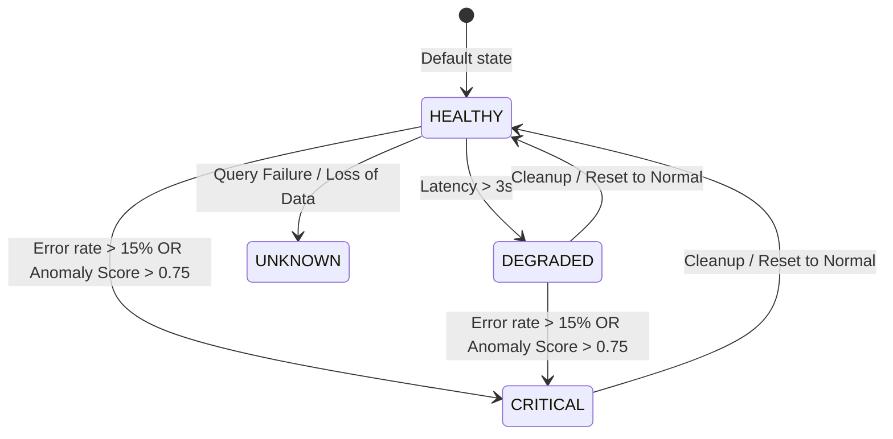

# Data Model: Chaos Testing & End-to-End Validation

This document defines the key entities and state representations for Phase 5.2.

## 1. Chaos Scenario Configuration

The chaos scenario defines the inputs passed to `chaos_script.py` to trigger the anomaly injection.

| Field | Type | Description | Validation / Constraints |
|-------|------|-------------|--------------------------|
| `target_url` | String | The HTTP endpoint to send load testing traffic to | Must be a valid HTTP/HTTPS URL |
| `anomaly_mode` | String | The anomaly behavior to set in the target service | Must be one of: `normal`, `error`, `latency` |
| `duration` | Integer | How long the test traffic and anomaly mode should run (seconds) | Must be positive, default: `60` |
| `rate` | Integer | Requests per second (RPS) to issue to the target | Must be positive, default: `10` |

## 2. System Health State

The health state represents the overall computed status of the microservices system, displayed in the unified Grafana panel.

### State Thresholds and Mapping

| Value | State Label | Color | Prometheus Condition |
|-------|-------------|-------|----------------------|
| `0` | `HEALTHY` | Green | Normal operation (default) |
| `1` | `DEGRADED` | Orange | Order Service p95 latency > 3 seconds |
| `2` | `CRITICAL` | Red | ML Anomaly Score > 0.75 OR Order Service 500 error rate > 15% |
| `null` | `UNKNOWN` | Gray | Prometheus query fails or returns no data |
